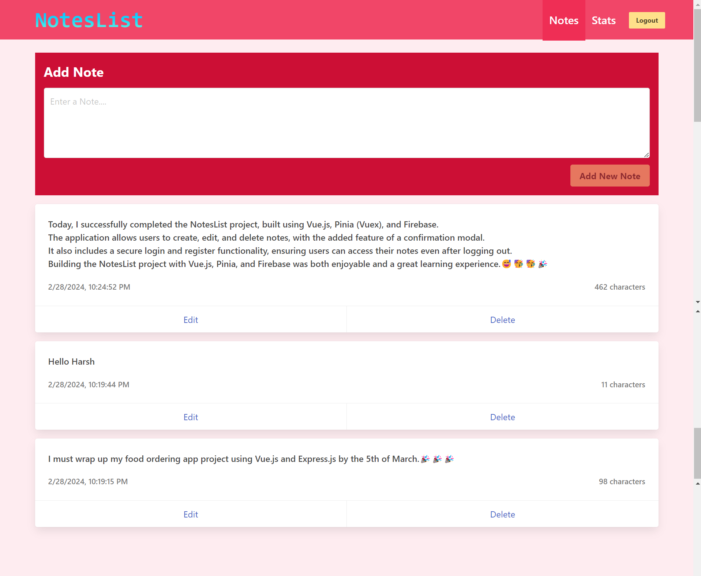
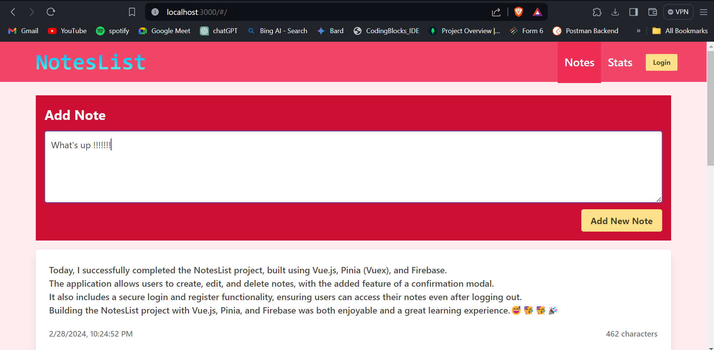
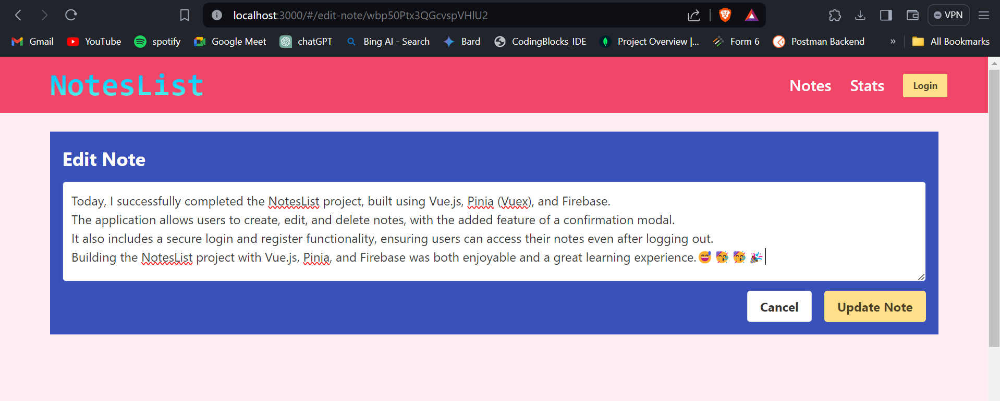
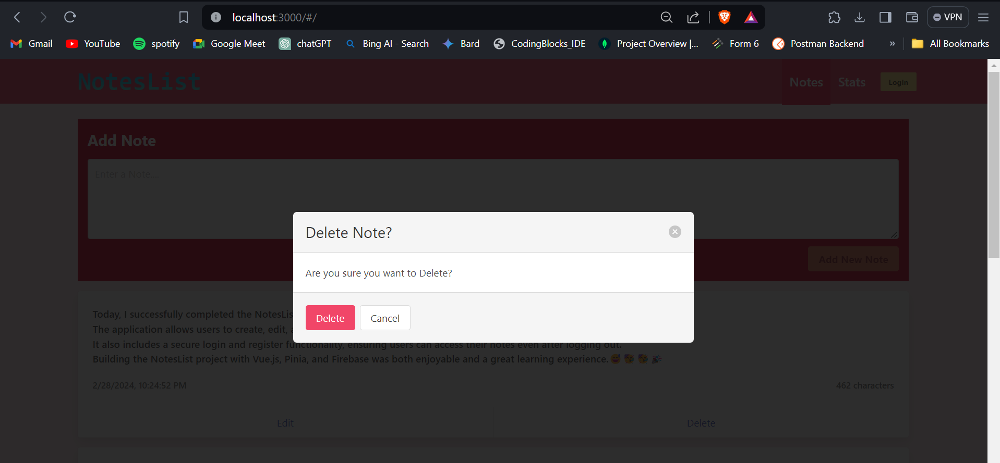
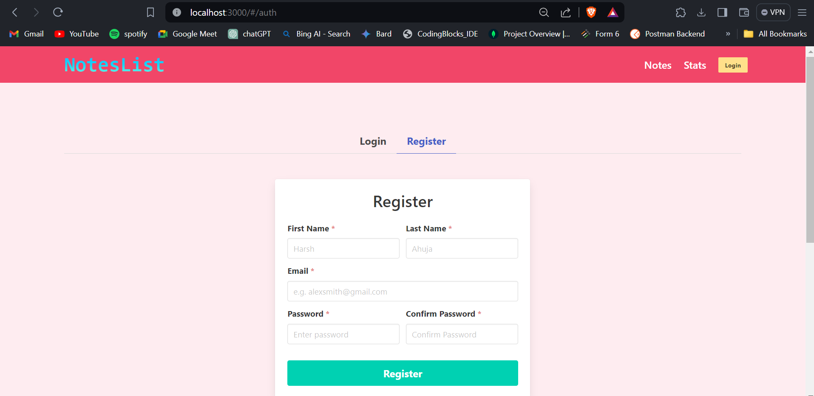
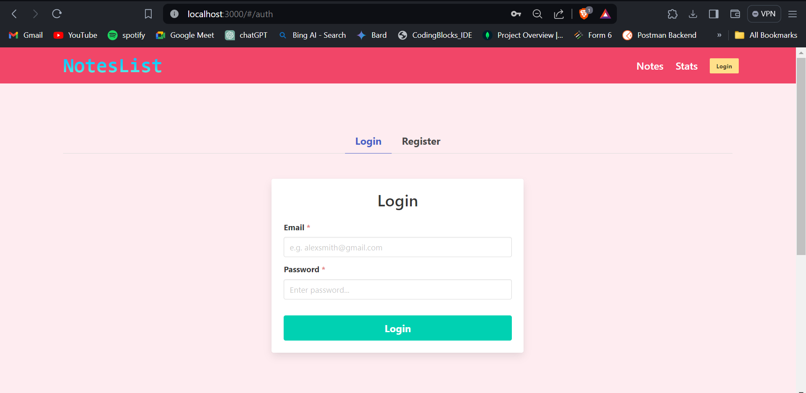

## NotesList Project
Welcome to NotesList – a dynamic note-taking web application built with Vue.js, JavaScript, and Firebase. This project allows users to effortlessly create, edit, and delete notes. With a sleek and intuitive design enhanced by vanilla CSS styling, NotesList provides a seamless user experience.

<hr>

## Features
Create Notes: Easily jot down your thoughts, ideas, or reminders with the note creation feature.

Edit Notes: Need to make changes? No problem! Edit your notes to keep them up-to-date.

Delete Notes: Remove unwanted notes with a simple click. A delete confirmation modal ensures reconfirmation.

User Authentication: Register and log in to securely save your notes to the Firebase database.

<hr>

## Technologies Used
<ul>
  <li>Vue.js: A progressive JavaScript framework for building user interfaces.</li>
  <li>JavaScript: The backbone of the project, providing functionality and interactivity.</li>
  <li>Firebase: A real-time database for secure and efficient data storage and retrieval.</li>
  <li>Vanilla CSS: Custom styling to enhance the visual appeal and usability of the application.</li>
</ul>

Getting Started
Clone the repository:
```sh
git clone [https://github.com/your-username/NotesList.git](https://github.com/harshahuja186/NotesList-vue.git)
```


Navigate to the project directory:
```sh
cd NotesList
```

Project Setup

```sh
npm install
```

Compile and Hot-Reload for Development

```sh
npm run dev
```


### Screenshots









